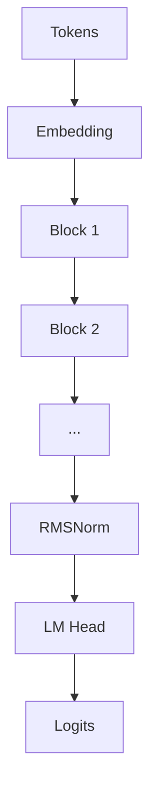

# Gemma 3 (≈270M) From Scratch

Small Language Model in pure PyTorch. From tokens to logits, no magic boxes. This repo walks you through data prep, architecture, training, and inference.

> Built to be educational first, production second. You can still train a capable TinyStories model on a single GPU.

---

## Highlights

- **Gemma‑style transformer core** with Grouped‑Query Attention, RMSNorm, RoPE.
- **Dual RoPE bases** for local and global attention, lets the model anchor short and long contexts.
- **Local sliding‑window layers** mixed with **global layers** for efficient long context.
- **Gated Feed‑Forward** using GELU gating, simple and fast.
- **Plain PyTorch**, easy to hack. No heavy trainer frameworks.

---

## Architecture at a glance



A transformer **Block** has two sublayers.

```mermaid
flowchart LR
  X[Input] --> N1[RMSNorm]
  N1 --> ATT[Grouped Query Attention]
  ATT --> P1[RMSNorm]
  P1 --> SUM1[Add & Residual]
  SUM1 --> N2[RMSNorm]
  N2 --> FF[Gated FFN\nGELU(xW1) ⊙ xW2 -> W3]
  FF --> P2[RMSNorm]
  P2 --> SUM2[Add & Residual]
```

**Attention flavor**

- **GQA**, many query heads, few key value heads, reduces KV cache size.
- **QK normalization** via RMSNorm on head vectors is optional in code.
- **RoPE** applied to Q and K. Two frequency bases are precomputed.
  - **Local base** for sliding‑window layers.
  - **Global base** for full attention layers.

**Masking**

- Local layers see a fixed window of past tokens.
- Global layers see the full causal past.

```text
mask_local(i, j) = j > i or i - j > window  -> masked
mask_global(i, j) = j > i                   -> masked
```

---

## What is in this repo

- `gemma_3_270M_scratch_final.py`
  - Data download and tokenization with `datasets` and `tiktoken`.
  - Model definition, RoPE utilities, masks, generate loop.
  - Simple training loop with AdamW, warmup, cosine decay, AMP.

You can run it as a single script. It is written like a clear notebook, minimal dependencies.

---

## Quickstart

### 1. Setup

```bash
python -m venv .venv && source .venv/bin/activate
pip install --upgrade pip
pip install torch torchvision torchaudio --index-url https://download.pytorch.org/whl/cu121  # choose CPU or your CUDA
pip install datasets tiktoken tqdm
```

### 2. Get data and build binary shards

The script fetches **TinyStories** from Hugging Face and saves token ids to disk. If you prefer manual prep, use this snippet.

```python
# tools/build_bins.py
from datasets import load_dataset
import numpy as np, tiktoken, os
enc = tiktoken.get_encoding("gpt2")

train_ids, val_ids = [], []
for split in ["train", "validation"]:
    ds = load_dataset("roneneldan/TinyStories", split=split)
    bucket = train_ids if split=="train" else val_ids
    for ex in ds:
        bucket.extend(enc.encode_ordinary(ex["text"]))

np.array(train_ids, dtype=np.uint16).tofile("train.bin")
np.array(val_ids,   dtype=np.uint16).tofile("val.bin")
```

Run it.

```bash
python tools/build_bins.py
```

### 3. Train

Minimal single GPU run.

```bash
python gemma_3_270M_scratch_final.py \
  --data_dir . \
  --device cuda \
  --batch_size 32 \
  --block_size 128 \
  --max_iters 150000 \
  --lr 1e-4 \
  --warmup_steps 1000
```

Tip, start shorter, verify loss drops, then scale it up.

### 4. Generate

```python
from gemma_3_270M_scratch_final import Gemma3Model
import torch, tiktoken
enc = tiktoken.get_encoding("gpt2")
model = Gemma3Model.from_pretrained("checkpoints/best.pt").eval().cuda()

prompt = "Once upon a time,"
ctx = torch.tensor([enc.encode_ordinary(prompt)], device="cuda")
out = model.generate(ctx, max_new_tokens=200, temperature=0.8, top_k=50)
print(enc.decode(out[0].tolist()))
```

---

## Configuration

Below is a compact config that tracks the code. Tweak it to trade quality for speed and memory.

```python
cfg = dict(
  # vocab and dims
  vocab_size=50257,    # tiktoken gpt2
  emb_dim=1024,        # model width
  n_layers=18,
  n_heads=16,
  n_kv_groups=4,       # GQA, heads per KV group = n_heads // n_kv_groups
  head_dim=64,         # q,k,v head size

  # attention schedule
  layer_types=[        # length must equal n_layers
    "local","local","global","local","local","global",
    "local","local","global","local","local","global",
    "local","local","global","local","local","global",
  ],
  local_window=256,    # tokens visible in local layers

  # rotary embeddings
  rope_base=10000.0,        # global base
  rope_local_base=5000.0,   # local base

  # ffn
  hidden_dim=4*1024,   # FFN expansion
  qk_norm=True,
  query_pre_attn_scalar=None,  # if set, rescales queries

  # training
  context_length=4096,
  dropout=0.0,
  dtype=torch.bfloat16,
)
```

**Why these choices**

- GQA keeps the KV cache compact and fast.
- A small set of global layers gives the model a long memory.
- Dual RoPE bases make local layers focus tight, global layers stay stable as context grows.

---

## Training knobs that matter

Short notes, the defaults in the script are sensible.

- **Batch size and block size**. Bigger helps, but watch memory. Increase `block_size` if your stories are cut off.
- **LR schedule**. Warmup to stabilize, cosine to land smoothly.
- **AdamW**. Weight decay around `0.1` works well on TinyStories.
- **AMP**. Use `torch.amp.autocast` with `bfloat16` on Ampere or newer.
- **Gradient accumulation**. Bump it if the GPU is small.

If validation loss plateaus, increase steps, or add a bit of dropout.

---

## Evaluation

Perplexity is the quick check. After training, run a small eval over `val.bin`.

```python
ppl = torch.exp(estimate_loss(model)["val"]).item()
print(f"val ppl ~ {ppl:.2f}")
```

You can also eyeball generations. Try a fixed prompt and keep temperature low if you want grammatical stories.

---

## Implementation notes

**RoPE utilities**

- Precompute `cos, sin` tables per head dim and base.
- Apply to Q and K before attention scores.

**Masks**

- Build once per sequence length. Keep on device as boolean.

**Gated FFN**

- Two projections, `fc1` and `fc2`, GELU gate, then `fc3` to project back.

**RMSNorm**

- Replace LayerNorm. Stable and a little cheaper.

**Generate loop**

- Typical greedy or top‑k sampling with temperature.

---

## Parameter counting

Rough estimate for the config above, not counting small norms and biases.

```python
def approx_params(cfg):
    V, D, L, H, G, Hd = cfg["vocab_size"], cfg["emb_dim"], cfg["n_layers"], cfg["n_heads"], cfg["n_kv_groups"], cfg["head_dim"]
    attn_q = D * (H*Hd)
    attn_kv = D * (G*Hd) * 2
    attn_o = (H*Hd) * D
    ffn = D*cfg["hidden_dim"]*2 + cfg["hidden_dim"]*D
    block = attn_q + attn_kv + attn_o + ffn
    emb = V*D + D*V
    return emb + L*block
```

Tune `emb_dim`, `n_layers`, `n_heads`, `head_dim` to land near your target, around 270M.

---

## Repro tips

- Fix `torch.manual_seed(42)`.
- Log train and val loss every few hundred steps.
- Save the best checkpoint by val loss, not by last step.

---

## Performance tips

- Set `pin_memory=True` and `num_workers>0` for DataLoader if you externalize batching.
- Keep token ids on disk, memory map reads.
- Use `torch.compile` on PyTorch 2 if kernels are stable on your setup.
- For long contexts, increase the ratio of local layers.

---

## Known limitations

- Script style is linear, great for learning, less flexible than a full trainer.
- No KV cache during generation in this minimal version. You can add it for speed.
- No checkpoint sharding yet.

---

## Credits and references

- The training data pipeline borrows the idea of writing token ids to `*.bin` files from the nanoGPT examples.
- Design choices are inspired by the Gemma family and other modern SLMs that mix local and global attention with GQA.
- Credits noted in the source file header.

---

## License

MIT, unless your organization needs something different. Add a LICENSE file and update this line if required.

---

## FAQ

**Why tiktoken gpt2 instead of sentencepiece**

It is simple and fast for TinyStories. Swap the tokenizer if your data needs different normalization.

**Is the model really 270M**

Depends on your config. Use the param estimator above, or print `sum(p.numel() for p in model.parameters())`.

**Can I train on CPU**

Yes, it will be slow. Use a small config and lower `block_size`.

**How do I change local vs global layers**

Edit `layer_types`. Keep the sequence simple. Two locals, one global, repeat.

---

## Minimal CLI

If you prefer flags over editing the script, add `argparse` like this.

```python
import argparse
p = argparse.ArgumentParser()
p.add_argument('--data_dir', default='.')
p.add_argument('--device', default='cuda')
p.add_argument('--batch_size', type=int, default=32)
p.add_argument('--block_size', type=int, default=128)
p.add_argument('--max_iters', type=int, default=150000)
p.add_argument('--lr', type=float, default=1e-4)
p.add_argument('--warmup_steps', type=int, default=1000)
args = p.parse_args()
```

Then use the values inside the script. Simple and effective.

